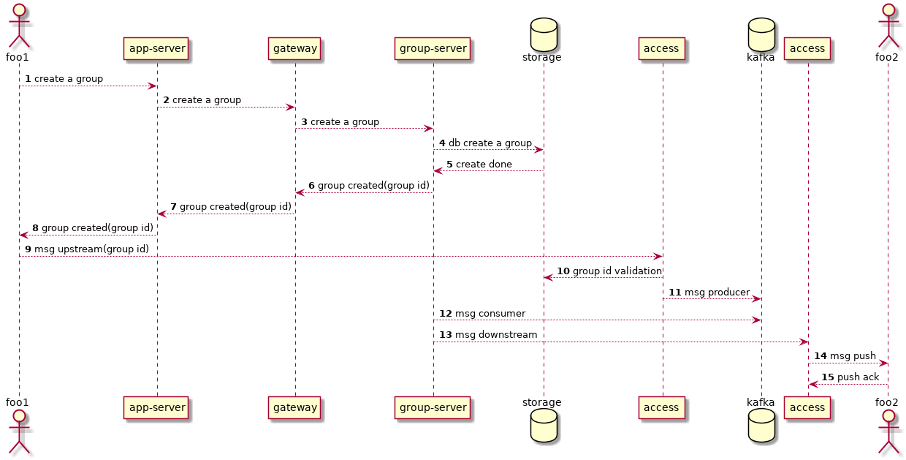

### 流程图

1. 用户接入流程


* 步骤1-6,需要通过app-server获取token, app-server 需在之前授权并获得有效的key和secret.

> app-server需另行搭建，只中转token请求，目的是 key 和 secret 不在客户端上保存，不安全

> gateway 代表IM 服务网关，所有http请求均会过该网关，方便做限流、熔断等待操作

* router服务会验证传入的key的合法性, 成功之后才可给予接入token.
* 接入规则:

```
需要在请求中加入4个Header
- AppId: 对应授权key
- Nonce: 随机串
- Timestamp: 时间值
- Sign: 数字签名，算法如下

Sign = SHA1(AppSecret + Nonce + Timestamp)
```

* 步骤7，8，客户端请求接入节点，需带上有效token.
* 步骤9，router服务会先验证token有效性，验证成功后会根据系统负载情况，分配最合适的接入节点地址

> router会根据请求客户端的不同，确定是回复websocket接入地址，还是socket接入地址

* 步骤10，11，回复接入节点
* 步骤12，客户端根据取到的接入节点地址和方式，长链接接入到access节点，并发送登录信息
* 步骤13，客户端登录IM系统完成，可使用IM服务

2. 单聊消息发送


* 步骤1，用户发送单聊消息
* 步骤2，接入服务作为消息生产者，将消息存入kafka

> 利用kafka保证消息不丢，发送到kafka的消息即可认为消息发送成功。后续节点宕机，只会操作kafka消息积压，但不会丢。

> 消息不重复，由客户端来保证，利用收到消息的message id做去重，重复的不做展示。

* 步骤3，kafka存储成功，即认为消息发送成功，不丢。
* 步骤4，接入服务返回，表示用户发送成功，并携带服务器提供的消息ID和存储时间
* 步骤5，单聊服务持续从kafka消费消息
* 步骤6，单聊服务将消息做持久化
* 步骤7，单聊服务通过目标用户id的相应算法找到下行接入节点，下发消息
* 步骤8，接入节点下发消息到客户端(推模式)
* 步骤9，目标用户确认接收完成

> 注：步骤8，9， 同样可以采用拉模式，即接入服务下发拉取通知，让用户自行拉取消息。

3. 群聊消息发送



* 步骤1，用户通过rest api请求应用服务器创建群组
* 步骤2~4，应用服务器通过server api请求群组创建群组，并持久化
* 步骤5~8，群组服务回复新的group id.
* 步骤9，客户端往接入服务发送消息，目标为 group id.
* 步骤10~15，消息处理与以上单聊消息基本相同